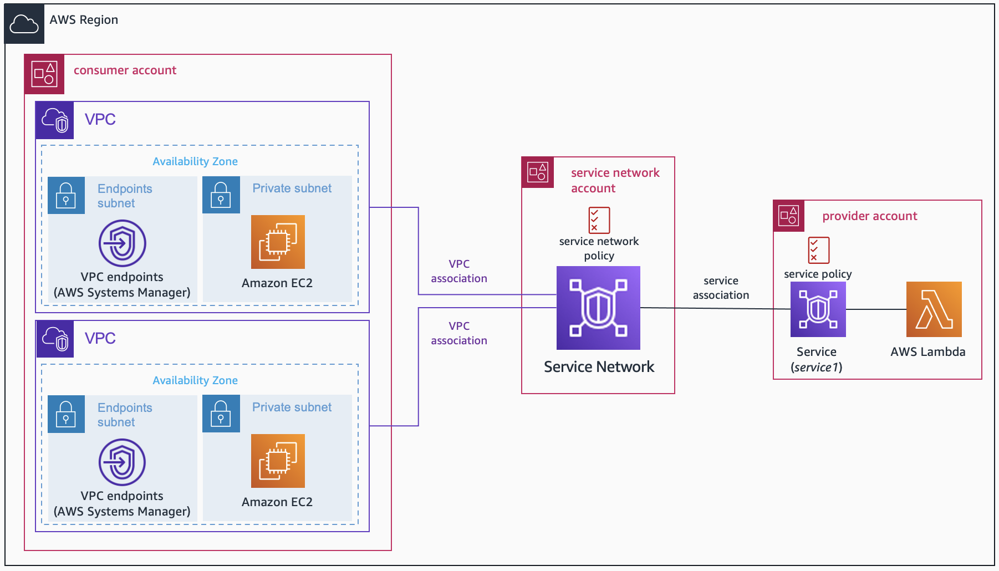

# Amazon VPC Lattice - Multi-Account Centralized Service Networks

In this example, we are showing a multi-Account environment with [Amazon VPC Lattice](https://docs.aws.amazon.com/vpc-lattice/latest/ug/what-is-vpc-lattice.html), focusing on a centralized service network pattern. A central AWS Account will own and manage the VPC Lattice [service networks](https://docs.aws.amazon.com/vpc-lattice/latest/ug/service-networks.html), while spoke AWS Accounts will be the ones creating the VPC Lattice [services](https://docs.aws.amazon.com/vpc-lattice/latest/ug/services.html) and [associating their VPCs](https://docs.aws.amazon.com/vpc-lattice/latest/ug/service-network-associations.html) to the service network.



An application can both consume services and be the target of another one. However, in this example we are supposing that the consumer and service provider are in different VPCs (and AWS Accounts), so we have 3 AWS Accounts involved in the architecture. Aside VPC Lattice resources, this example also deploys the following:

* [AWS Resource Access Manager](https://docs.aws.amazon.com/ram/latest/userguide/what-is.html) - to share the service network and service between AWS Accounts
* [AWS Secrets Manager](https://docs.aws.amazon.com/secretsmanager/index.html) secrets - to share the service network and service IDs between AWS Accounts.
  * [AWS KMS](https://docs.aws.amazon.com/kms/latest/developerguide/overview.html) key to encrypt the secrets.
* In the consumer AWS Account, Amazon VPCs, EC2 instances, and VPC endpoints (for [AWS Systems Manager session manager](https://docs.aws.amazon.com/systems-manager/latest/userguide/session-manager.html) access) are deployed to test service consumption.
* In the service provider AWS Account, an [AWS Lambda](https://docs.aws.amazon.com/lambda/latest/dg/welcome.html) function is deployed.

## Prerequities

* Three AWS Accounts - make sure you use different AWS credentials when initializing the provider in each folder.
* Terraform installed.

## Code Principles

* Writing DRY (Do No Repeat Yourself) code using a modular design pattern.

## Usage

* Clone the repository and move to the corresponding folder.

```
git clone https://github.com/aws-samples/multi-account-architectures-amazon-vpc-lattice.git
cd centralized_service_network
```

* Edit the *variables.tf* in each folder to configure your environments:
  * *consumer-account*: you need to provide the central AWS Account ID (the one creating the VPC Lattice service network). In addition, you can configure the VPCs information (value provided by default).
  * *service-network-account*: you need to provide the spoke AWS Account IDs (consumer and service provider).
  * *service-account*: you need to provide the central AWS Account ID (the one creating the VPC Lattice service network).
* In all folders you can configure as well the AWS Region (value provided by default). Make sure you choose the same AWS Region for all the AWS Accounts, as all the resources created are regional.

## Deployment

Given we are working in a multi-Account environment, we need to deploy the resources in a specific order. The idea is also to show what is the normal deployment flow in a real environment when having centralized VPC Lattice resources - plus Secrets Manager secrets when sharing information between AWS Accounts.

**In each step, make sure you use the proper AWS Account (folder).**

### Step 1: Creating AWS Secrets Manager secrets (*service-network-account*)

The first thing to deploy are the AWS Secrets Manager secrets that are going to be used to exchange information between AWS Accounts. This secrets are created and managed by the central AWS Account - providing read or write permissions to the spoke AWS Accounts (depending the secret).

```
cd service-network-account
terraform apply -target="aws_secretsmanager_secret.service_network" -target="aws_secretsmanager_secret.lattice_services"
```

### Step 2: Amazon VPC Lattice service (*service-account*)

Once we have the AWS Secrets Manager secrets ready to share information between them, time to deploy VPC Lattice resources! First, the service (with a Lambda function as target).

```
cd service-account
terraform apply
```

You will deploy the VPC Lattice service, share it with the central AWS Account, and update the Secrets Manager secret (*lattice_services*) with the service ID - used by the central AWS Account to do the service association. Note the output of this deployment (**service_domain_name.lambdaservice**) as you will need this domain name to test connectivity in the consumer AWS Account.

### Step 3: Amazon VPC Lattice service network (*service-network-account*)

Time now to create the resources in the central AWS Account: VPC Lattice service network (and RAM share to the consumer Account) and service association (of VPC Lattice service shared from the service Account).

```
cd service-network-account
terraform apply
```

### Step 4: Amazon VPCs (consumer applications) and VPC Lattice VPC associations

Last thing is the consumer VPCs so we can test the service consumption. We are deploying two VPCs - each one of them with EC2 instances and VPC endpoints for SSM access - to show the two different ways to create VPC Lattice VPC associations with different Terraform modules: [VPC module](https://registry.terraform.io/modules/aws-ia/vpc/aws/latest) and [VPC Lattice module](https://registry.terraform.io/modules/aws-ia/amazon-vpc-lattice-module/aws/latest).

```
cd consumer-account
terraform apply
```

## Testing connectivity

Time to test that everything works properly! To connect to the VPC Lattice service created in the service Account, let's jump to the consumer AWS Account and connect to any of the EC2 instances created. As we deployed VPC endpoints to access AWS Systems Manager, you can connect to them using SSM Session Manager.

Once inside the EC2 instances, let's start doing DNS resolution of the VPC Lattice's domain name.

```
dig {domain_name}
```

Note that this domain name was generated by VPC Lattice, but you can also configure [custom domain names](https://docs.aws.amazon.com/vpc-lattice/latest/ug/service-custom-domain-name.html). DNS resolution will give us a link-local address (inside the 169.254.171.X range), basically telling us that to consume that service the traffic needs to be sent to the VPC Lattice association. If you configure a custom domain name, you will need to create an [Amazon Route 53 private hosted zone](https://docs.aws.amazon.com/Route53/latest/DeveloperGuide/hosted-zones-private.html) to map this custom domain name to the VPC Lattice generated one (CNAME record).

```
curl {domain_name}
```

You should receive something similar to *"Hello from Lambda!"*. You are now connecting applications in different VPCs in a multi-Account environment using Amazon VPC Lattice. The example provided is simple to avoid extra costs when deploying the environment, so take into account the following **best practices** when working with VPC Lattice:

* Use custom domain names and HTTPS listeners to make sure your traffic is encrypted. You will need to provide your [own certificate](https://docs.aws.amazon.com/vpc-lattice/latest/ug/service-byoc.html) (using [AWS Certificate Manager](https://docs.aws.amazon.com/acm/latest/userguide/acm-overview.html)) when creating the VPC Lattice service.
* We provided an example on how to include an [auth policy](https://docs.aws.amazon.com/vpc-lattice/latest/ug/auth-policies.html) in both service network and service, but the IAM policy used is very open (allowing both authenticated and unauthenticated access). VPC Lattice works with [Signature Version 4 (SigV4)](https://docs.aws.amazon.com/vpc-lattice/latest/ug/sigv4-authenticated-requests.html) for client authentication. Our recommendation is use SigV4 and/or your own authentication method to make sure requests are only allowed from trusted consumers.

## Cleanup

Same as with the deployment, we need to destroy the resources in a certain order.

* First, remove all the resources in the consumer AWS Account (*consumer-account*)

```
cd consumer-account
terraform destroy
```

* Remove the VPC Lattice resources from the central AWS Account (*service-network-account*)

```
cd service-network-account
terraform destroy -target="module.vpclattice_service_network"
```

* Remove all the resources in the service provider AWS Account (*service-account*)

```
cd service-account
terraform destroy
```

* Finally, remove the resources left in the central AWS Account (*service-network-account*)

```
cd service-network-account
terraform destroy
```